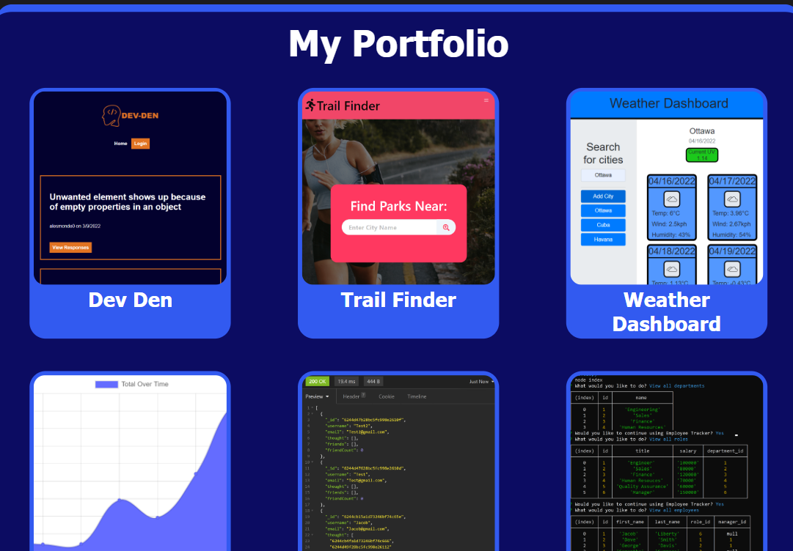

  # React Portfolio
  [](https://opensource.org/licenses/MIT)

  ## Table of Contents:

  ---
  * [Description](#description)
  * [Installation](#installation)  
  * [Usage](#usage)  
  * [Credits](#credits)    
  * [Tests](#tests)  
  * [Questions](#questions)  

  ## Description

  ---
  This project is my professional portfolio updated and re-done using the react framework.

  ## Installation:

  ---
  To install all necessary dependencies for this program,
  open the console and run the following command:  
  ```npm i```

  ## Usage

  ---
  This project is used to display my projects, skills, and resume as a digital portfolio to show to companies hiring developers.
  
  
  Link to Deployed Application:
  https://jacobgit3.github.io/React-Portfolio/

  ## Technology Used:

  ---
  react.js
  node.js 
  javascript 
  css 

  ## Tests

  ---
  To test this application run this command in the console:  
  ```npm start```

  ## Questions

  ---
  For any questions feel free to reach out through the following contacts:  

  Email: jacob.tobin.liberty@gmail.com  
  Github: https://github.com/JacobGit3  
  
